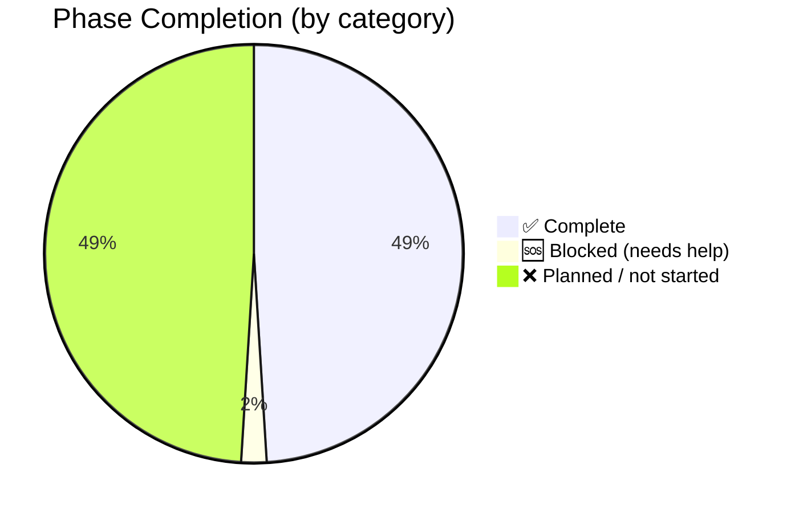
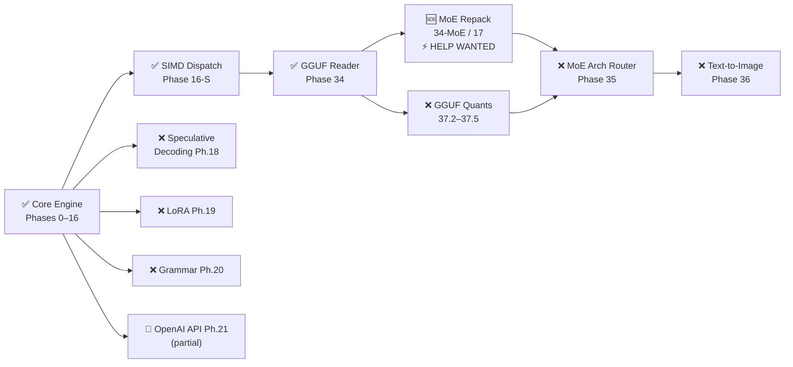

# Project Zero — Roadmap

This document tracks all implementation phases against the original master plan in [`IMPLEMENTATION_PLAN.md`](../docs/architecture/IMPLEMENTATION_PLAN.md). The full architectural vision is in [`CPU_LLM_TERNARY_ENGINE.md`](../docs/architecture/CPU_LLM_TERNARY_ENGINE.md).

---

## 📊 Progress at a Glance



| Track | Progress | Count |
|---|---|---|
| Core Engine (Phases 0–16) | `██████████` **100%** | 17 / 17 |
| Performance Tuning (K-series) | `██████████` **100%** | 6 / 6 |
| GGUF / MoE Pipeline (34–37) | `████░░░░░░` **40%** | 2 / 5 *(34-MoE blocked)* |
| Extended Roadmap (17–36) | `░░░░░░░░░░` **0%** | 0 / 20 *(fully spec'd, not started)* |
| **Overall** | `████░░░░░░` **~49%** | **25 / 51** |

---

## 🗺️ Critical Path



---

## Performance Snapshot

```
Hardware          Model                     tok/s    vs DRAM ceil
─────────────────────────────────────────────────────────────────
i5-5250U (T=4)    SmolLM2-135M F16 (dense)   83.79   peak (VNNI, INT4 head)
Xeon (Emerald R.) BitNet-b1.58-2B-4T Q2      36.25   95% ████████████████████░
i5-11300H         BitNet-b1.58-2B-4T Q2      16.10   87% █████████████████░░░░
Xeon              DeepSeek-V2-Lite Q4_K_S     1.06   11% ██░░░░░░░░░░░░░░░░░░░ ← MoE bottleneck
                                                         ceiling: 9.8 tok/s
```

Dense GGUF transformers (Llama-family) run through the architecture-agnostic GGUF loader;
SmolLM2-135M is the verified dense model, other standard architectures load but are untested.

Verified on [OpenBenchmarking.org](https://openbenchmarking.org/result/2606063-SHIF-PROJECT91) · 1.83× faster than bitnet.cpp on same hardware.

---

## Status Legend

| Symbol | Meaning |
|--------|---------|
| ✅ | Complete and merged to master |
| 🔄 | In progress / partially implemented |
| ❌ | Planned, not started |
| 🆘 | Blocking — help wanted |

---

## Core Engine (Phases 0–16)

| Phase | Feature | Status | Key files |
|-------|---------|--------|-----------|
| **0** | Project scaffolding, build system, Makefile, CMake | ✅ | `Makefile`, `CMakeLists.txt` |
| **1** | Core data structures — `Config`, `TransformerWeights`, `RunState` | ✅ | `include/core/` |
| **2** | Memory subsystem — `mmap`, aligned alloc, zero-OOM guarantee | ✅ | `src/core/memory.c` |
| **3** | Math primitives — ternary matmul, RMSNorm, Softmax, RoPE | ✅ | `src/math/` |
| **4** | Threading — CPU probe, C11 atomics spin-then-sleep thread pool | ✅ | `src/threading.c` |
| **5** | Tokenizer — BPE load, encode, decode | ✅ | `src/tokenizer/` |
| **6** | Transformer forward pass — embedding, attention, FFN, generate | ✅ | `src/transformer/` |
| **7** | Sampling — argmax, temperature, top-p, top-k, RNG | ✅ | `src/sampling.c` |
| **8** | KV cache — INT8 quantization, sliding window, adaptive strategy | ✅ | `src/kv_cache.c` |
| **9** | Hidden reasoning engine — `<think>` tag state machine | ✅ | `src/reasoning.c` |
| **10** | Weight packing — 2-bit ternary, HF converter, fused kernels | ✅ | `tools/convert_hf_bitnet.py` |
| **11** | Multimodal vision — SigLIP encoder, patch embed, MLP projector, KV injection | ✅ | `src/vision/` |
| **12** | CLI — arg parsing, REPL, boot sequence | ✅ | `src/cli/` |
| **13** | Test harness — 24 unit tests, benchmark suite | ✅ | `tests/` |
| **14** | Agentic tools — `<exec>`, `<save_memory>`, `<think>` interceptor, secure executor | ✅ | `src/agent/` |
| **15** | RAG / Vector DB — embedder, cosine search, auto-retrieval, persistent `.vrdb` | ✅ | `src/rag/` |
| **16-S** | SIMD multi-arch — runtime dispatch: AVX-512 VNNI → AVX-VNNI → AVX2 → NEON → Scalar | ✅ | `src/math/cpu_features.c`, `src/math/dispatch.c` |

---

## Performance Tuning (K-series)

| Phase | Feature | Status | Result |
|-------|---------|--------|--------|
| **K-2** | Non-temporal stores (`_mm512_stream_ps`) on weight loads | ✅ | Reduced LLC eviction pressure |
| **K-3** | SiLU vectorization, prefetch alignment | ✅ | +3% on Tiger Lake |
| **K-4** | Caller-participates threading (main thread joins pool) | ✅ | +5% on 4-core configs |
| **K-5** | PGO + LTO build target | ✅ | +8–12% across all configs |
| **Preq** | Layer-level pre-quantization (Q/K/V + gate/up INT8) | ✅ | Reduces activation bandwidth |
| **Calib.** | First-run calibration — DRAM BW probe, L3 detection, thread auto-set | ✅ | Zero-config deployment |

**Current best:** 36.25 tok/s on Xeon (Emerald Rapids) — 95% of DRAM bandwidth ceiling. [Verified on OpenBenchmarking.org](https://openbenchmarking.org/result/2606063-SHIF-PROJECT91).

---

## GGUF / MoE Pipeline (Phases 34–37)

| Phase | Feature | Status | Notes |
|-------|---------|--------|-------|
| **34** | GGUF reader — metadata, tokenizer, tensor loading | ✅ | DeepSeek-V2-Lite-Chat Q4_K_S runs correctly |
| **34-MoE** | MoE expert weight scatter — contiguous access at inference time | 🆘 **BLOCKING** | 13× behind llama.cpp. Root cause: non-contiguous DRAM offsets. [Discussion #1](https://github.com/shifulegend/project-zero/discussions/1) |
| **35** | GGUF MLA+MoE architecture router — deepseek2 tensor mapping, stacked expert slicing | ❌ | Fully specified in `IMPLEMENTATION_PLAN.md §35` |
| **37.1** | Q2_K dequant | ✅ | Needed for DeepSeek-V2-Lite-Chat-Q2_K |
| **37.2** | Q3_K dequant | ❌ | 256 elems, 110 bytes/block |
| **37.3** | Q4_1 dequant | ❌ | 32 elems, 20 bytes/block |
| **37.4** | Q8_1 dequant | ❌ | 32 elems, 36 bytes/block (fp32 scale) |
| **37.5** | Q5_1, Q5_K, Q6_K dequant | ❌ | Required for Phase 35 MLA loading |

---

## Planned Phases (17–36)

These are fully specified in `IMPLEMENTATION_PLAN.md` with file inventories, struct definitions, and function signatures. Not yet started — **except Phase 21, which is partially implemented** (see the note below the table).

| Phase | Feature | Depends on | Skill needed |
|-------|---------|------------|--------------|
| **17** | MoE expert weight repacking at load time | Phase 34-MoE fix | C, GGUF Q4_K layout, memory layout |
| **18** | Speculative decoding — draft model + verification loop | Phase 6 | C, transformer math |
| **19** | LoRA adapters — hot-swappable, low-rank merge at inference | Phase 6 | C, linear algebra |
| **20** | Grammar-constrained decoding — FSM, JSON mode, BNF parser | Phase 7 | C, automata theory |
| **21** 🔄 | OpenAI-compatible API layer — `/v1/chat/completions`, streaming | Phase 12 | C, HTTP/SSE |
| **22** | State Space Models — Mamba/RWKV architecture router | Phase 6 | C, SSM math |
| **23** | PagedAttention + continuous batching | Phase 8 | C, memory management |
| **24** | Dynamic context scaling — YaRN/NTK RoPE extension | Phase 6 | C, RoPE math |
| **25** | Native audio — Whisper encoder, audio tokenizer | Phase 11 | C, DSP |
| **26** | Radix cache — KV prefix sharing across requests | Phase 8 | C, trie data structures |
| **27** | Cache tiling — L3-optimal attention blocking | Phase 8 | C, cache math |
| **28** | Distributed inference — tensor parallelism across machines | Phase 4 | C, networking |
| **29** | WASM sandbox — safe tool execution in agent loop | Phase 14 | C, WASM runtime |
| **30** | MCTS / PRM — Monte Carlo tree search for reasoning | Phase 7 | C, search algorithms |
| **31** | NVMe tiering — weight streaming from SSD for RAM-constrained devices | Phase 2 | C, io_uring / direct I/O |
| **32** | Test-Time Training (TTT) — runtime weight adaptation | Phase 6 | C, autograd lite |
| **33** | Output watermarking — undetectable statistical signature | Phase 7 | C, probability theory |
| **36** | Text-to-image — Stable Diffusion / Flux (DDIM scheduler, U-Net, VAE) | Phase 35 | C, diffusion math, image I/O |

> **🔄 Phase 21 (OpenAI-compatible API) — partially implemented.** `src/api/` ships a
> working loopback HTTP server behind `--server`/`--port`, serving `POST /v1/chat/completions`
> (streaming + non-streaming SSE), `GET /v1/models`, and `GET /health` with real model
> inference. **Remaining before it can be marked ✅:** concurrent request handling (the
> listener is currently serial, one connection at a time), optional non-loopback bind,
> socket-level integration tests, and CI coverage — the existing tests
> (`tests/test_api_server.c`) cover only the JSON/chat-template/SSE logic, not the socket
> server. It is also not yet documented in the README.

---

## 🆘 Help Wanted Right Now

The two highest-impact contributions that unblock all MoE-related phases:

### 1. MoE Expert Weight Repacking (Phase 34-MoE / 17)

**Problem:** DeepSeek-V2-Lite has 64 experts per MoE layer. Each token activates 6. Those 6 experts sit at non-contiguous DRAM offsets in the GGUF file — gaps of ~140 MB between each. Result: 86% L3 miss rate, effective bandwidth drops from 11.7 GB/s to ~2–3 GB/s.

**Fix:** Repack expert weights at model load time so the top-K experts for common activation patterns are physically contiguous. llama.cpp does this in `llama_model_load_internal()`. The challenge: preserving Q4_K superblock boundaries during the repack.

**Discussion + full profiling data:** [Discussion #1](https://github.com/shifulegend/project-zero/discussions/1)

### 2. Native Q4_K Matmul Kernel

**Problem:** DeepSeek dense layers currently dequantize Q4_K blocks to FP32, then run standard matmul. An AVX-512 VNNI kernel operating directly on 4-bit superblocks (no FP32 intermediate) would cut effective memory bandwidth by ~8× for these layers.

**Reference:** ggml's `ggml_vec_dot_q4_K_q8_K` in `ggml-quants.c`

---

## Community Benchmarks

Run the engine on your hardware and add your result: [Discussion #3](https://github.com/shifulegend/project-zero/discussions/3)

---

## 🎯 Language & Dependency Goals

The engine is written in C. Two deliberate, **temporary** deviations from the
"pure C, zero-Python" target are tracked here for cleanup so the stated identity and
the tree stay consistent:

| Item | Current state | Target |
|------|---------------|--------|
| **Chat templating** | `src/tokenizer/chat_template.cpp` is the one C++17 translation unit in the engine | Port to C so the engine is 100% C |
| **Python tooling** | `tools/*.py` handle offline model conversion, benchmarking, and fuzz/test harnesses — used for development and testing only | Final product ships with **no Python**; the runtime already needs none to build or run |

The broader direction is to make the engine **LLM-agnostic** — run any architecture
that fits and executes on a CPU — through the GGUF reader and the planned
architecture routers (Phases 35 and 22).

---

## Architecture References

| Document | Contents |
|----------|----------|
| [`IMPLEMENTATION_PLAN.md`](../docs/architecture/IMPLEMENTATION_PLAN.md) | Complete phase-by-phase specification (2907 lines, file inventories, struct definitions) |
| [`CPU_LLM_TERNARY_ENGINE.md`](../docs/architecture/CPU_LLM_TERNARY_ENGINE.md) | Original architectural vision — ternary math, hardware adaptation, mmap design |
| [`MOE_RESEARCH_AND_FIX_PLAN.md`](../docs/architecture/MOE_RESEARCH_AND_FIX_PLAN.md) | DeepSeek MoE optimization research — 8 attempted fixes (P1–P8), profiling data |
| [`docs/KERNEL_INTERNALS.md`](../docs/KERNEL_INTERNALS.md) | VBMI kernel, thread pool design, KV cache layout, MoE scatter analysis |
| [`docs/PERFORMANCE_CEILING_REPORT.md`](../docs/PERFORMANCE_CEILING_REPORT.md) | Hardware bottleneck analysis — bandwidth math, LLC miss profiling |
