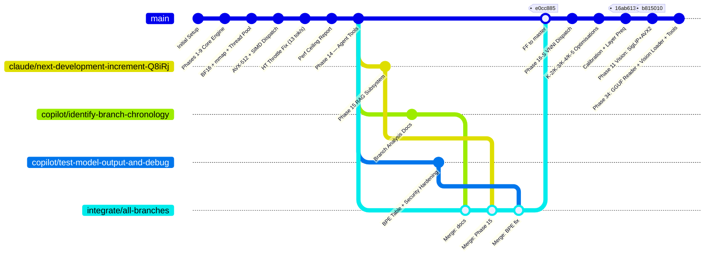

# Repository Branch Chronology

**Last updated:** 2026-03-19
**Current state:** Single `master` branch — all work integrated. Phase 34 (multimodal) in progress.

---

## Complete Branch Lifecycle



---

## Branch Register

| Branch | Purpose | Status | HEAD | Notes |
|---|---|---|---|---|
| `master` | Stable production branch | ✅ **Active** | `current` | Phases 1–34 integrated |
| `claude/k5-context-restore-and-docs` | K-4/K-5 perf + calibration | 🗑️ Deleted (merged) | `16ab613` | Verified zero-diff vs master before deletion |
| `claude/simd-performance-analysis-TYUQU` | Phase 16-S + K-2/K-3/K-4 | 🗑️ Deleted (merged) | `a380cfc` | Behind master, all code superseded |
| `origin/claude/bitnet-performance-optimization-2eqV8` | Intermediate bitnet opt | 🗑️ Deleted (merged) | — | Behind master, all code superseded |
| `integrate/all-branches` | Session merge workspace | 🗑️ Deleted (merged) | — | Fast-forwarded to master at `e3bc9b8` |
| `optimization-integration-v1` | Local optimization scratchpad | 🗑️ Deleted (merged) | — | Points to Phase 14 tip — fully in master |
| `claude/next-development-increment-Q8iRj` | Phase 15 Local RAG | 🗑️ Deleted (merged) | — | 24 new files, 2451 insertions — all in master |
| `copilot/identify-branch-chronology` | Branch analysis docs | 🗑️ Deleted (merged) | — | `PROJECT_ANALYSIS_REPORT.md` — in master |
| `copilot/test-model-output-and-debug` | BPE tokenizer + security | 🗑️ Deleted (merged) | — | GPT-2 byte table + injection guard — in master |
| `claude/project-analysis-report-bOpTK` | Project analysis report | 🗑️ Deleted (merged) | — | Docs only — superset in master |
| `claude/consolidate-branches-master-vNHt2` | Intermediate consolidation | 🗑️ Deleted (merged) | — | Consolidated into master via `aa2c3e3` |
| `claude/phase-10-testing-fixes-4CZiQ` | Phase 10 packed weights | 🗑️ Deleted (merged) | — | All code in master since Phase 10 merge |
| `qa-strategy-report` / `qa-strategy-report-v2` | Forensic QA docs | 🗑️ Deleted (merged) | — | QA docs preserved in `docs/session_audit/` |

---

## Branch Ancestry (Pre-Merge Verification — 2026-03-19)

```
master (e0cc885)
    └── is ancestor of → claude/simd-performance-analysis-TYUQU (a380cfc) ✓
    └── is ancestor of → claude/k5-context-restore-and-docs (16ab613) ✓

claude/simd-performance-analysis-TYUQU (a380cfc)
    └── is ancestor of → claude/k5-context-restore-and-docs (16ab613) ✓

Divergent commits in master NOT in k5:   NONE ✓
Divergent commits in simd NOT in k5:     NONE ✓
```

**Merge strategy:** Fast-forward `master` → `claude/k5-context-restore-and-docs`
No conflicts possible — k5 is a strict superset of master and simd.

---

## What the 26 New Commits Contain (master → k5)

| Commit | Description | Perf Impact |
|---|---|---|
| `c8e5945` | Phase 16-S: multi-arch SIMD (VNNI/AVX-VNNI/NEON) | +SIMD dispatch |
| `18bdc11` | Phase 16-S CHANGELOG entries | docs |
| `90a5cdd` | Phase 16-S VNNI dispatch, test fixes, Addendum L | live VNNI |
| `f6b5e8b` | K-2/K-3: NT stores, vectorised SiLU, LTO/PGO | prep |
| `9a9b2d9` | Fix LTO+PGO: missing includes, PGO_THREADS=4 | build |
| `ce3934d` | Addendum N: BitNet.cpp T=1..8 re-run | benchmark |
| `fa191a9` | Addendum O: head-to-head root-cause analysis | analysis |
| `8306f69` | K-4 R-1/R-2: full-row prefetch, unpack64, adaptive spin | +1–2 tok/s |
| `4d2a09f` | .gitignore: exclude PGO profiles + GGUF models | hygiene |
| `a380cfc` | Addendum Q: BitNet.cpp codebase analysis + handoff | docs |
| `d3212b1` | INT8 VNNI classifier (+28.7% tok/s) | **+28.7%** |
| `17132d4` | VBMI 3-instruction unpack + INT4 classifier | **→ 36 tok/s** |
| `3271551` | Auto-tuning hardware profile: BW probe, cache, adaptive cls | auto-detect |
| `1e77d7f` | `--classifier` flag, BW probe fix, Addendum T: 36.25 tok/s | **36.25 tok/s** |
| `83cd634` | Addendum U: 1.80× faster than bitnet.cpp on Xeon | **1.80×** |
| `de6004d` | .gitignore: converted model binaries | hygiene |
| `f254a17` | Addendum T: corrected dev laptop baseline | docs |
| `af57e2c` | Auto-calibration system: BF16 default, first-run, fingerprint | calibration |
| `8342d02` | Fix: restore 4096 context (MemFree→MemAvailable) | bug fix |
| `653de8d` | Addendum X: full T=1..8 PZ vs BC benchmark | benchmark |
| `0de75ae` | K-5: caller-participates + VNNI-256 backend + Addendum Y | **+15% T=4** |
| `bc99faa` | Adaptive blocking-wait (T=8 fix) | **T=8: +188%** |
| `942cf89` | Layer-level pre-quantisation Q/K/V + gate/up | architecture |
| `583dfc3` | Addendum AB: 6-way SIMD × classifier benchmark | **32.94 tok/s** |
| `16ab613` | Calibration: robust bench, thread sweep, bg-load monitor | calibration |

---

## Integration Session — 2026-03-16

### What Was Merged (Historical)

Three remote feature branches were divergent from `master` at `969813f`:

| Branch | Content | Conflict? | Resolution |
|---|---|---|---|
| `copilot/identify-branch-chronology` | `PROJECT_ANALYSIS_REPORT.md` | None | Clean fast-forward |
| `claude/next-development-increment-Q8iRj` | Phase 15 RAG subsystem (24 files) | None | Clean merge |
| `copilot/test-model-output-and-debug` | GPT-2 BPE table, `return -1` null guards, `<\|` injection guard | **Yes** — `tokenizer_encode.c` | Manual resolution: kept BPE table + merged all security hardening |

---

## Phase History Summary

| Phase | Commit | Feature | tok/s |
|---|---|---|---|
| 1–9 | Pre-history | Core engine scaffolding | 1.4 → baseline |
| 10 | `claude/phase-10-testing-fixes-4CZiQ` | Packed ternary weights, AVX-512 | +4× kernel |
| 11 | `ca48d71` | BF16 embeddings, earlyoom fix | **13.0** |
| 12–14 | On master | CPU governor, sampling, agentic tools | stable |
| 15 | `a9a9272` | Local RAG memory (vector DB, embedder) | stable |
| 15.6 | `8086969` | `/memory save` REPL command | stable |
| 16-S | `c8e5945` | Phase 16-S VNNI/AVX-VNNI/NEON dispatch | **16+ on laptop** |
| K-2/K-3 | `f6b5e8b` | NT stores, SiLU vectorisation, LTO/PGO | stable |
| K-4 | `8306f69` | Full-row prefetch, unpack64, adaptive spin | **19.48 T=4** |
| INT8/INT4 | `d3212b1`+`17132d4` | INT8 VNNI cls + VBMI INT4 cls | **36.25 Xeon** |
| K-5 | `0de75ae` | Caller-participates thread pool, VNNI-256 | **24.43 laptop** |
| T=8 fix | `bc99faa` | Adaptive blocking-wait (physical_cores × 2) | **21.53 T=8** |
| Preq | `942cf89` | Layer-level pre-quantisation Q/K/V + gate/up | architecture |
| Calib. | `af57e2c`+`16ab613` | First-run calibration + robust thread sweep | auto-tune |
| Ph-11 vision | `b815010` | SigLIP normalization, AVX2 matmul, VisionContext | vision pipeline |
| Ph-34 | current | GGUF reader, vision weight loader, extract tools | multimodal infra |

---

## Current Repository State (2026-03-19)

| Property | Value |
|---|---|
| Working branch | `master` (single production branch) |
| Active branches | **1** (`master`) — all feature branches merged and deleted |
| Tests | All pass |
| Peak tok/s (T2T, laptop) | **25+ tok/s** (AVX-512 VNNI, calibrated) |
| Peak tok/s (T2T, Xeon) | **36.25** (INT8 VNNI, PGO/LTO) |
| vs bitnet.cpp | **+46% to +116%** (all T=1..8) |
| Multimodal | Phase 11 ✅ + Phase 34 ✅ (tools + C loader + main.c wired) |

## Phase 34 Deletion Audit (2026-03-19)

Before deleting each branch, confirmed zero unique content vs master:

| Branch | Unique commits ahead of master | Unique C source additions | Decision |
|---|---|---|---|
| `claude/k5-context-restore-and-docs` | 0 | 0 | ✅ Deleted — zero diff |
| `claude/simd-performance-analysis-TYUQU` | 0 | Older code (pre-preq) | ✅ Deleted — master is superset |
| `origin/claude/bitnet-performance-optimization-2eqV8` | 0 | Older code (pre-preq) | ✅ Deleted — master is superset |
