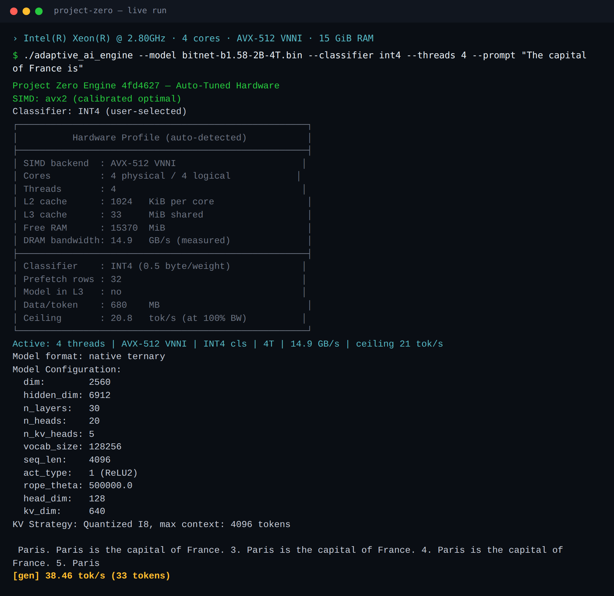
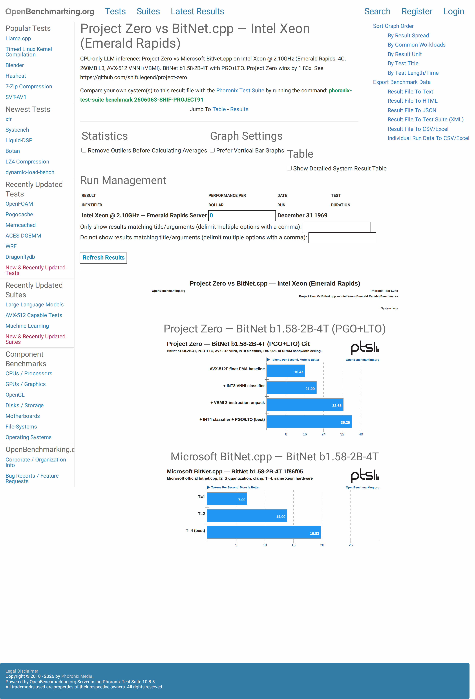
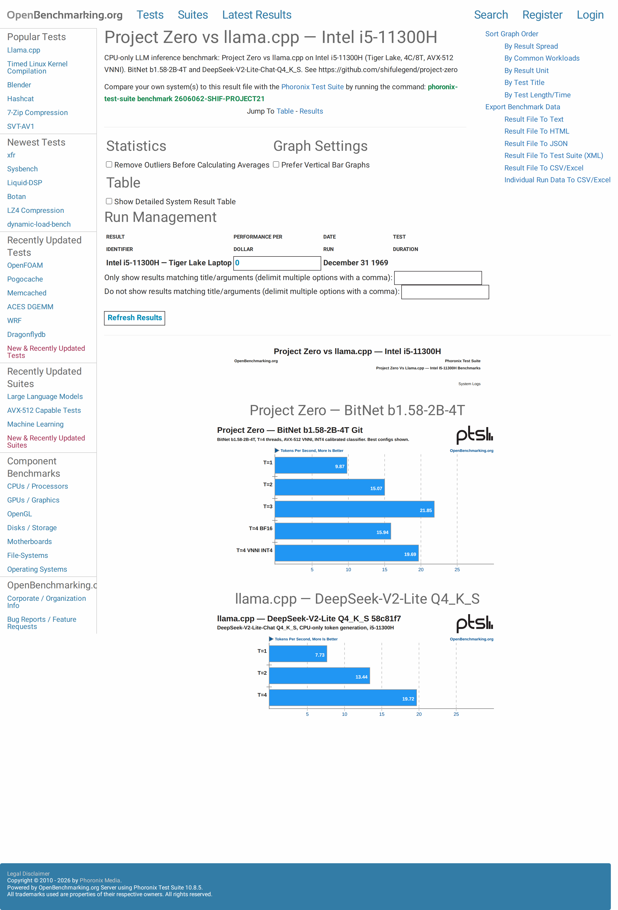

# Project Zero — CPU LLM Inference Engine

[](LICENSE)
[](src/)
[](src/math/)
[](https://openbenchmarking.org/result/2606207-SHIF-PROJECT42)
[](CONTRIBUTING.md)

<p align="center">
  
</p>

[Benchmarks](#benchmarks) · [Quick Start](#quick-start) · [Help Wanted](#help-wanted) · [Docs](docs/)

---

Pure C, single binary. Runs Microsoft's BitNet b1.58 **1.80× faster than Microsoft's own `bitnet.cpp`** — and dense GGUF models — no GPU, no Python, no ML framework.

- **Pure C, zero runtime deps** — `make release`, one executable, nothing else required
- **1.80× faster than bitnet.cpp** — at 95% of the analytical DRAM bandwidth ceiling ([reproduced on OpenBenchmarking.org ↓](#benchmarks))
- **One binary, two model families** — BitNet ternary and dense F16 GGUF, no per-model rebuild

---

<a id="benchmarks"></a>

## Benchmarks

**BitNet b1.58-2B-4T vs. Microsoft `bitnet.cpp`** — same model, same Intel Xeon (AVX-512 VNNI), same thread count:

| Threads | Project Zero | bitnet.cpp (i2_s) | Gain |
|---|---|---|---|
| 1 | **5.91 tok/s** | 4.96 | +19% |
| 2 | **12.78 tok/s** | 9.46 | +35% |
| 3 | **18.61 tok/s** | 13.59 | +37% |
| 4 | **21.45 tok/s** | 16.10 | +33% |

Optimized (PGO+LTO, INT4 classifier): **36.25 tok/s = 95% of the analytical DRAM bandwidth ceiling** on a 4-core Xeon.

> On dense models, Project Zero leads `llama.cpp` at 1–3 threads (+32%/+4%/+15%) and trails at peak 4-thread. On DeepSeek-V2 MoE it runs ~7× slower — this is the known open problem ([Help Wanted ↓](#help-wanted)).

📊 **Third-party results on OpenBenchmarking.org** — not self-reported:

| Xeon vs. bitnet.cpp | i5-11300H vs. llama.cpp |
|---|---|
| [](https://openbenchmarking.org/result/2606207-SHIF-PROJECT42) | [](https://openbenchmarking.org/result/2606208-SHIF-PROJECT03) |

**Run it yourself and post your result:** [Discussion #3 — community benchmarks](https://github.com/shifulegend/project-zero/discussions/3)

---

<a id="quick-start"></a>

## Quick Start

**Option A — pre-built binary (Linux x86-64, no compiler needed):**

```bash
wget https://github.com/shifulegend/project-zero/releases/download/v0.1.0/adaptive_ai_engine-0.1.0-x86_64-linux.tar.gz
tar xf adaptive_ai_engine-0.1.0-x86_64-linux.tar.gz
./adaptive_ai_engine --model models/bitnet-b1.58-2B-4T.bin \
  --tokenizer models/bitnet-b1.58-2B-4T_tokenizer_proper.bin \
  --prompt "The capital of France is"
```

**Option B — build from source (60 seconds):**

```bash
git clone https://github.com/shifulegend/project-zero.git
cd project-zero
make demo   # builds engine + downloads SmolLM2-135M + runs a test prompt
```

Expected output: `The capital of France is Paris.`

No GPU. No Python at runtime. No API key. GCC or Clang + `make` + `curl` — nothing else.

---

<a id="help-wanted"></a>

## Help Wanted

Two open problems where outside expertise would make a real difference:

| Problem | Current state | Target |
|---|---|---|
| **MoE expert weight repacking** | DeepSeek-V2-Lite runs at 1.90 tok/s — 7× behind `llama.cpp`. Top-K expert weights sit at non-contiguous GGUF offsets: **~86% L3 cache miss rate per token**. Fix: repack selected expert weights into contiguous memory at load time, matching llama.cpp's interleaved layout. | ≥ 9 tok/s |
| **Native Q4_K matmul kernel** | Current dense-model path dequants Q4_K → F32 before multiply. A fused mixed-precision kernel would close the remaining gap to `llama.cpp` on dense 4-bit GGUF models. | — |

Existing SIMD work documented in [`docs/KERNEL_INTERNALS.md`](docs/KERNEL_INTERNALS.md).
MoE repacking thread: [Discussion #1](https://github.com/shifulegend/project-zero/discussions/1)

---

## What It Does

Runs [Microsoft's BitNet b1.58-2B-4T](https://huggingface.co/microsoft/bitnet-b1.58-2B-4T) ternary weights and **dense GGUF transformers** (SmolLM2, DeepSeek-V2-Lite) on commodity CPUs — from scratch, in C.

Also included in the same binary: OpenAI-compatible HTTP API (`--server --port 8080`), persistent RAG memory (`--memory-db`), SigLIP vision pipeline (`--vision`), and an agentic tool-use loop (`/agent`).

No GPU required. Python is offline tooling only (model conversion, testing).

> ⚠️ **Before contributing:** read [`GOLDEN_RULES.md`](GOLDEN_RULES.md). No hardcoding. Test after every change.

---

## Hardware

Memory bandwidth is the bottleneck — the engine reads 420–680 MB of weights per token. SIMD backend and thread count are auto-detected at startup.

| RAM config | BitNet tok/s | Notes |
|---|---|---|
| 4 GB | ~8–10 | disable earlyoom |
| 8 GB single-channel DDR4 | ~13 | bandwidth ceiling |
| 16 GB dual-channel DDR4 | ~16 | measured (+24% over single-ch) |

SIMD: AVX-512 VNNI → AVX2 → NEON → Scalar, selected at startup.

---

## Architecture

```
adaptive_ai_engine
├── src/math/       AVX-512 VBMI ternary kernel, VNNI INT8/INT4, AVX2/NEON fallbacks
├── src/core/       mmap weight loader (zero-copy), GGUF architecture-agnostic parser
├── src/sampling/   top-p / temperature (static 200K buffer, no malloc per token)
├── src/threading/  C11 atomic spinlock thread pool (no futex per dispatch)
└── src/transformer/ forward pass, attention, FFN, RoPE, KV cache (int8-quantized)
```

Key design choices: `mmap` + `POSIX_MADV_WILLNEED` for weight loading, runtime SIMD dispatch via function pointers, sliding-window int8 KV cache for 131k context, BF16 embeddings (660 MB smaller vs F32, no precision loss).

---

## Build

```bash
make release      # -O3 -march=native (default)
make debug        # ASan + UBSan
make test         # 3,367 assertions across all modules
make clean
```

Requirements: GCC or Clang, pthreads, libm. No other dependencies.

---

## CLI Reference

```bash
./adaptive_ai_engine \
  --model   models/bitnet-b1.58-2B-4T.bin \
  --tokenizer models/bitnet-b1.58-2B-4T_tokenizer_proper.bin \
  --prompt  "Your prompt here" \
  --threads 4 \
  --max-tokens 256
```

Key flags: `--temperature`, `--top-p`, `--seed`, `--classifier {bf16|int8|int4|auto}`, `--server --port 8080`, `--memory-db path.vrdb`, `--image photo.jpg --vision vision.bin --proj projector.bin`

Full flag reference and REPL commands: run `./adaptive_ai_engine --help`

---

## Docs

| Document | What it covers |
|---|---|
| [KERNEL_INTERNALS.md](docs/KERNEL_INTERNALS.md) | AVX-512 VBMI kernel, MoE scatter problem, thread pool design |
| [PERFORMANCE_CEILING_REPORT.md](docs/PERFORMANCE_CEILING_REPORT.md) | Full optimization journal: 1.4 → 36.25 tok/s, bandwidth math |
| [DEBUGGING_JOURNAL.md](docs/DEBUGGING_JOURNAL.md) | Root-cause log of every major perf regression and fix |
| [ROADMAP.md](.github/ROADMAP.md) | Phase status (✅/🆘/❌), active blockers, planned phases |
| [CONTRIBUTING.md](CONTRIBUTING.md) | Build, test, and contribution protocol |
| [DEVELOPER_ONBOARDING.md](DEVELOPER_ONBOARDING.md) | Testing mandate, QA protocol, branching strategy |

---

*Phase 34+ · BitNet b1.58-2B-4T · DeepSeek-V2-Lite-Chat (GGUF) · SmolLM2-135M F16 · SigLIP vision*
*Best: **36.25 tok/s** (BitNet, Xeon PGO+LTO) · **83.79 tok/s** (SmolLM2 F16) · **1.80× vs bitnet.cpp** · 95% DRAM ceiling*
